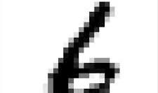

# Handwritten Digit Recognition using CNN

## Project Overview
This project recognizes handwritten digits (0–9) using a Convolutional Neural Network (CNN) trained on the MNIST dataset.

## Technologies Used
- Python
- TensorFlow
- Keras
- OpenCV
- NumPy
- Matplotlib

## Dataset
MNIST handwritten digits dataset.

## Model Used
Convolutional Neural Network (CNN)

## Accuracy
Achieved approximately 98% test accuracy.

## Features
- Digit recognition
- CNN-based classification
- Custom image prediction
- Model saving/loading

## Project Workflow
1. Load Dataset
2. Preprocess Images
3. Build CNN Model
4. Train Model
5. Evaluate Accuracy
6. Predict Digits

## Output
The model successfully predicts handwritten digits from uploaded images.

### Sample Input and Prediction (Static)

Predicted digit: 6

## Author
Gangaprasad Urekar